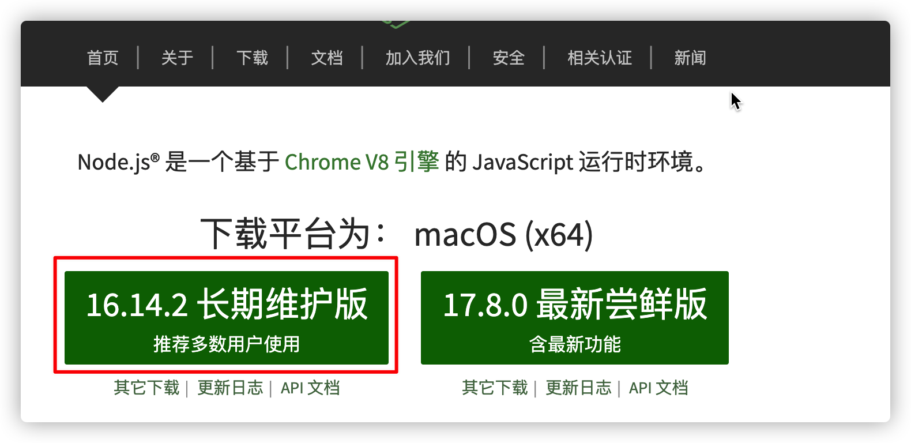
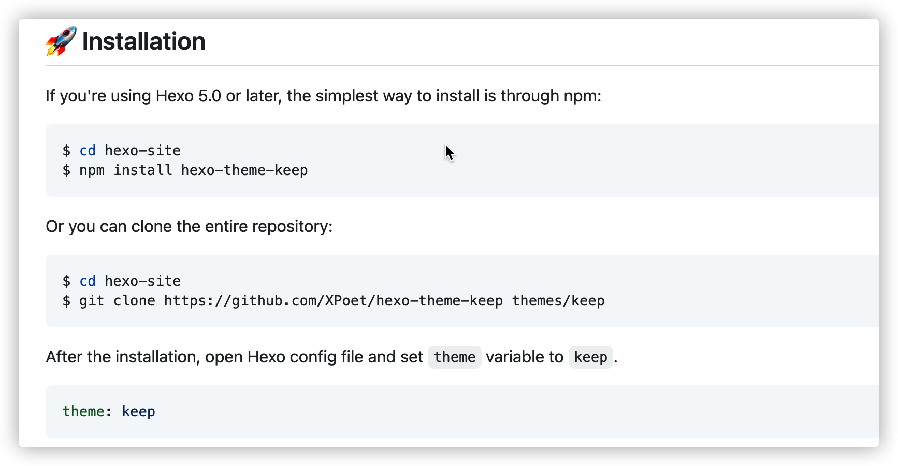
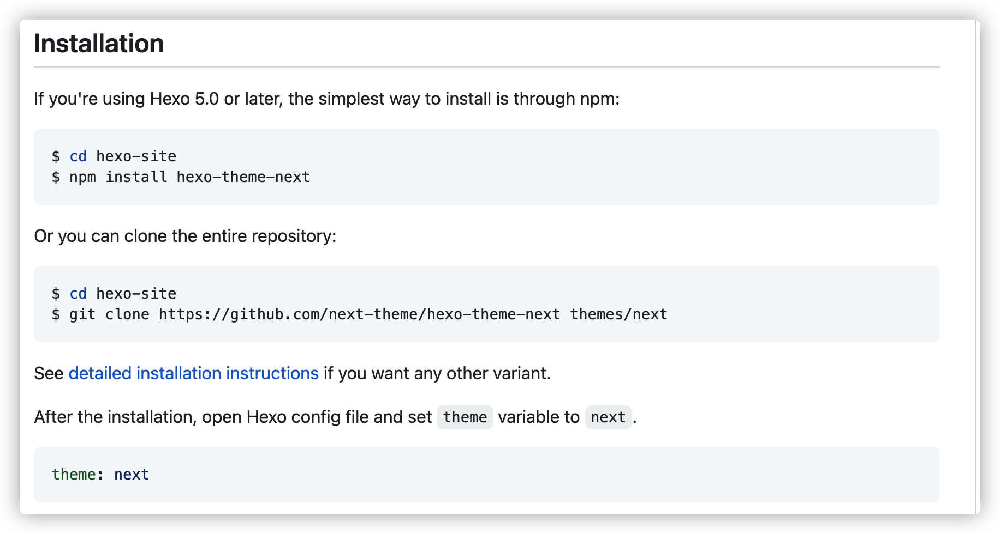
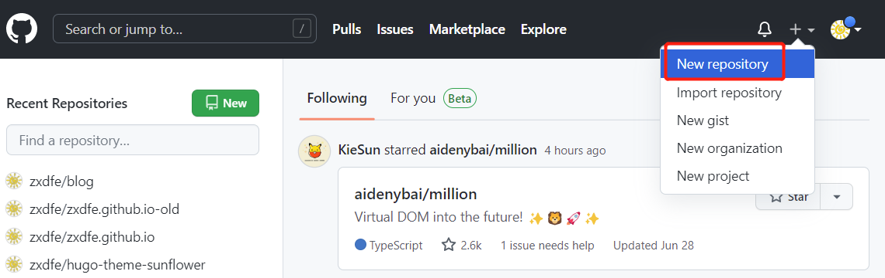
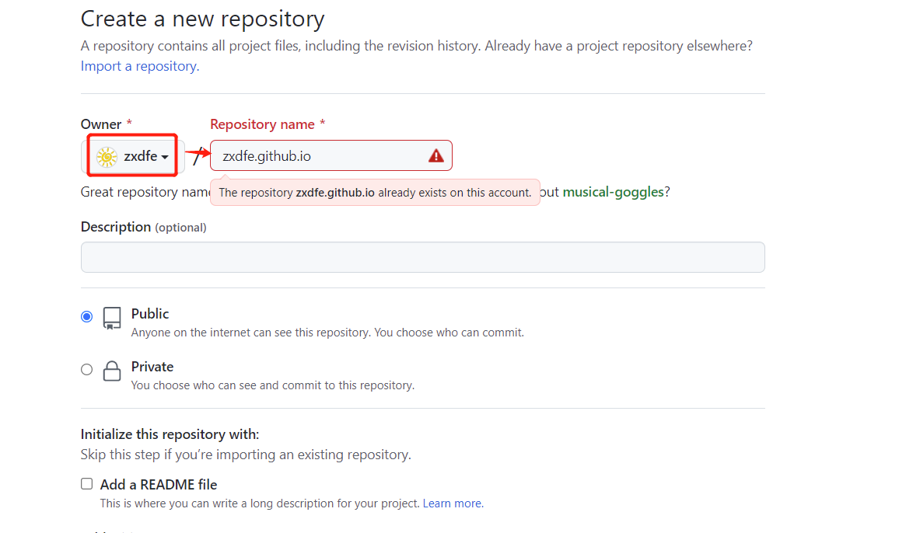
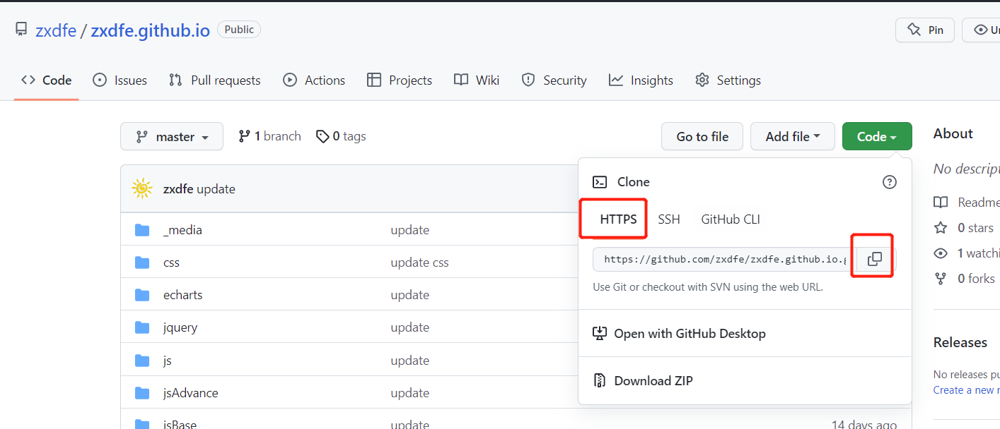
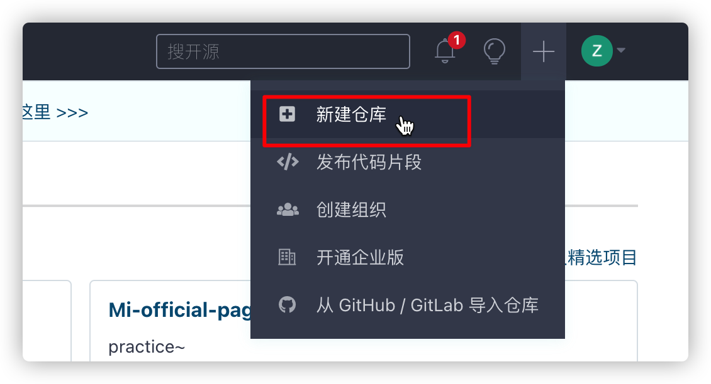
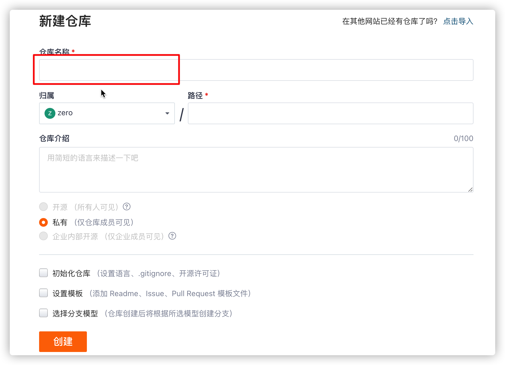

## 1. 了解Node

Node.js 是一个基于 Chrome V8 引擎的 JavaScript 运行时, 它不是一门新的语言哈。

我们暂时不用太在意它的一些知识点，不需要现在学习。

目前只需要知道如何安装，然后如何使用一些简单的命令来实现我们现阶段想要做的功能。

### 1.1 安装Node

我们进入Node的官网  [Node.js](https://nodejs.org/zh-cn/)

- [如何安装Node.js](https://www.runoob.com/nodejs/nodejs-install-setup.html)
- 查看安装好的版本
- terminal 终端     [什么是终端?](https://blog.csdn.net/wxiao_xiao_miao/article/details/120228056)
- win+R  输入 cmd  回车， 可以打开终端

```bash
# 查看安装的node版本 
node -v
# 或者
node --version
```

- 这里推荐安装长期维护版本 （LTS版本）（Long Term Support 长期支持维护的意思）



### 1.2 什么是npm

npm是随同Node.js一起安装的**包管理工具**, 我们可以通过`npm install`等一些命令安装我们需要的第三方包（库）

- 查看版本

```bash
npm -v
```

- 安装第三方包

```bash
npm install xxx
# 或者简写为
npm i xxx
```

### 1.3 如果安装慢

##### 1. 设置淘宝镜像

```js
npm config set registry https://registry.npmmirror.com/
```

##### 2. 查看当前镜像

```js
npm config get registry
```

##### 3. 还原镜像

```js
npm config set registry https://registry.npmjs.org/
```

### 1.4 pnpm

- https://www.pnpm.cn/motivation  目前更好的安装方式

```sh
// 设置
npm config set registry https://registry.npmmirror.com/
yarn config set registry https://registry.npmmirror.com/
pnpm config set registry https://registry.npmmirror.com/
// 查看
npm config get registry
yarn config get registry
pnpm config get registry
```

| npm 命令        | pnpm 等价命令                                     |
| --------------- | ------------------------------------------------- |
| `npm install`   | [`pnpm install`](https://www.pnpm.cn/cli/install) |
| `npm i <pkg>`   | [`pnpm add `](https://www.pnpm.cn/cli/add)        |
| `npm run <cmd>` | [`pnpm `](https://www.pnpm.cn/cli/run)            |


### 1.3 Git

Git（读音为/gɪt/）是一个开源的分布式版本控制系统，可以有效、高速地处理从很小到非常大的项目版本管理。

从一般开发者的角度来看，git有以下功能：

1、从服务器上克隆完整的Git仓库（包括代码和版本信息）到单机上。

2、在自己的机器上根据不同的开发目的，创建分支，修改代码。

3、在单机上自己创建的分支上提交代码。

4、在单机上合并分支。

5、把服务器上最新版的代码fetch下来，然后跟自己的主分支合并。

6、生成补丁（patch），把补丁发送给主开发者。

7、看主开发者的反馈，如果主开发者发现两个一般开发者之间有冲突（他们之间可以合作解决的冲突），就会要求他们先解决冲突，然后再由其中一个人提交。如果主开发者可以自己解决，或者没有冲突，就通过。

8、一般开发者之间解决冲突的方法，开发者之间可以使用pull 命令解决冲突，解决完冲突之后再向主开发者提交补丁。


上图展示了git的整体架构，以及和各部分相关的主要命令。先说明下其中涉及的各部分。

**工作区(working directory)，**简言之就是你工作的区域。对于git而言，就是的本地工作目录。工作区的内容会包含提交到暂存区和版本库(当前提交点)的内容，同时也包含自己的修改内容。

**[暂存区](https://www.zhihu.com/search?q=暂存区&search_source=Entity&hybrid_search_source=Entity&hybrid_search_extra={"sourceType"%3A"answer"%2C"sourceId"%3A625881308})(stage area, 又称为索引区index)，**是git中一个非常重要的概念。是我们把修改提交版本库前的一个过渡阶段。查看GIT自带帮助手册的时候，通常以index来表示暂存区。在工作目录下有一个.git的目录，里面有个index文件，存储着关于暂存区的内容。git add命令将工作区内容添加到暂存区。

**本地仓库(local repository)，**版本控制系统的仓库，存在于本地。当执行git commit命令后，会将暂存区内容提交到仓库之中。在工作区下面有.git的目录，这个目录下的内容不属于工作区，里面便是仓库的数据信息，暂存区相关内容也在其中。这里也可以使用merge或rebase将**远程仓库副本**合并到本地仓库。图中的只有merge，注意这里也可以使用rebase。

**远程版本库(remote repository)，**与本地仓库概念基本一致，不同之处在于一个存在远程，可用于远程协作，一个却是存在于本地。通过push/pull可实现本地与远程的交互；

**远程仓库副本，**可以理解为存在于本地的远程仓库缓存。如需更新，可通过git fetch/pull命令获取远程仓库内容。使用fech获取时，并未合并到本地仓库，此时可使用git merge实现远程仓库副本与本地仓库的合并。git pull 根据配置的不同，可为git fetch + git merge 或 git fetch + git rebase。rebase和merge的区别可以自己去网上找些资料了解下。


**Git 的一些相关命令**

```bash
git --version  					# 查看git版本
git clone	+ address			# 克隆某个从库
git status     					# 查看当前修改状态
git add .       				# 添加所有修改内容到暂存区
git commit -m "msg" 				# 将暂存区内容提交到本地仓库
git push 								# 将本地仓库内容，提交到远程仓库
git pull                # 将远程仓库内容拉取，并与本地仓库合并
git fetch  							# 将远程仓库内容拉取到--> 本地的远程仓库缓存中， 暂不合并到本地仓库。
```


## 2. 了解静态blog

https://jamstack.org/generators/

静态文档，什么是静态呢，就是说我们的数据都是本地准备好的，没有和后端做一个网络http请求上的数据交互。

比如说我们的typora笔记是markdown格式的，我们可以通过docsify这个第三方库，直接将我们的md文件生成静态文档，而不需要向后端请求动态数据。

静态文档(blog)的生成工具（库）有很多，常用的有

- hexo （基于node.js，可选主题很多）
- hugo   （基于go，速度快）
- vuePress （Vue官网就是通过它写的）
- docsify  （轻量简洁）
- next.js  （基于React SSR ，强大）

大家以后有时间都可以尝试着搭建一下哈


## 3. hexo

Hexo 是一个快速、简洁且高效的博客框架。Hexo 使用 [Markdown](http://daringfireball.net/projects/markdown/)（或其他渲染引擎）解析文章，在几秒内，即可利用靓丽的主题生成静态网页。  --> 2012年

### 3.1 安装Node.js / Git

安装 Hexo 相当简单，只需要先安装下列应用程序即可：

- **[Node.js](http://nodejs.org/)** 

  - (Node.js 版本需不低于 10.13，建议使用 Node.js 12.0 及以上版本)
  - 太高会报warning警告  
  - https://registry.npmmirror.com/binary.html?path=node/  node其他版本

- **[Git](http://git-scm.com/)**

  - http://git-scm.com/download/mac
  - http://git-scm.com/download/win

  

### 3.2 全局安装 hexo

```bash
npm install hexo-cli -g
```

#### 1. 新建一个文件夹 hexo-blog

```bash
hexo init
npm install    # npm i   # yarn install
```

装好后, 文件内的目录结构大致如下

- 看官方文档 - https://hexo.io/zh-cn/docs/setup

其中，source存放我们的草稿和post文件。 theme是主题文件夹

```js
.
├── _config.yml
├── package.json
├── scaffolds
├── source
|   ├── _drafts
|   └── _posts
└── themes
```

1. _config.yml 网站配置信息 https://hexo.io/zh-cn/docs/configuration
2. package.json

`package.json` 文件是项目的清单。 它可以做很多完全互不相关的事情。 例如，它是用于工具的配置中心。 它也是 `npm` 和 `yarn` 存储所有已安装软件包的名称和版本的地方。

省略。。。

PS. 

- 淘宝镜像源 https://npmmirror.com/

- 迁移2022-6-30： https://zhuanlan.zhihu.com/p/465424728?spm=a2c6h.24755359.0.0.6d444dccWMZOJM

### 3.2 命令

1. **new** 新建一篇文章

```bash
hexo new post title  # 如果标题包含空格， 用“” 或'' 引起来
hexo new post "好好学习 天天向上"
hexo n "第一篇博客"  # 简写
hexo n test        # 没有引号也可以
```

2. **generate** 生成静态文件

```bash
hexo generate
hexo g        # 简写
```

3. **server** 启动服务器 

默认情况下，访问网址为： `http://localhost:4000/`

```bash
hexo server
hexo s       # 简写
```

4. **deploy**    部署

```js
hexo deploy
hexo d        # 简写
```

5. **clean**   清缓存

```bash
hexo clean
```

清除缓存文件 (`db.json`) 和已生成的静态文件 (`public`)。

在某些情况（尤其是更换主题后），如果发现您对站点的更改无论如何也不生效，您可能需要运行该命令。


### 3.3 theme 主题

https://hexo.io/themes/

挑一个喜欢的安装~~~  Enjoy！

点击主题蓝色的文字 进入 github主题库的安装说明， 按步骤来就好了~~

For Example

**keep 主题**



If you're using Hexo 5.0 or later, the simplest way to install is through npm:

```
$ cd hexo-site
$ npm install hexo-theme-keep
```

Or you can clone the entire repository:

```
$ cd hexo-site
$ git clone https://github.com/XPoet/hexo-theme-keep themes/keep
```

After the installation, open Hexo config file and set `theme` variable to `keep`.

```
theme: keep
```

**Next 主题**



### 3.4 一键部署

1. 安装 [hexo-deployer-git](https://github.com/hexojs/hexo-deployer-git)。

```bash
npm install hexo-deployer-git --save
```

#### - 部署在Github

#### 1. github 中新建仓库


#### 2. 注意仓库命名!



**注意: 我们的blog仓库名字 必须是 github 的 `用户名 +github.io `   ==>    `username.github.io` !**

#### 3. 复制仓库地址




#### 4. 修改_config.yml中部署相关配置

```bash
deploy:
  type: git
  repo: <repository url> #https://bitbucket.org/JohnSmith/johnsmith.bitbucket.io
  branch: [branch]
  message: [message]
  改为===>
  
  deploy:
  type: 'git'
  repo: https://gitee.com/vrfe/hexo-blog.git   # 刚才复制的地址
  branch: master  # 改为master     注意  冒号:后面有一个空格!
```

#### 5. 执行hexo打包发布命令

```bash
hexo g   # 产生部署文件  generate
hexo d   # deploy  部署 上传
# 可以简写合并 
hexo g -d    # 打包部署上传,  一键完成部署
```


#### - 2 部署在gitee

2. gitee中新建仓库

   



2. 修改_config.yml中部署相关配置。

```bash
deploy:
  type: git
  repo: <repository url> #https://bitbucket.org/JohnSmith/johnsmith.bitbucket.io
  branch: [branch]
  message: [message]
```

```bash
deploy:
  type: 'git'
  repo: https://gitee.com/vrfe/hexo-blog.git
  branch: master
```

3. 执行命令

```js
hexo g
hexo d
# 合并 
hexo g -d
```


---


## 4.docsify

- [docsify-官网](https://docsify.js.org/#/zh-cn/quickstart)

### 4.1 全局安装

```bash
npm i docsify-cli -g
```

### 4.2 本地预览

```bash
# cd 到 docs 目录，执行
docsify serve
```


## 5.环境变量

环境变量相当于给系统或用户应用程序设置的一些参数，比如path环境变量，是告诉系统，当要求系统运行一个程序而没有告诉它程序所在的完整路径时，系统除了在当前目录下面寻找此程序外，还应到path中指定的路径去找。
