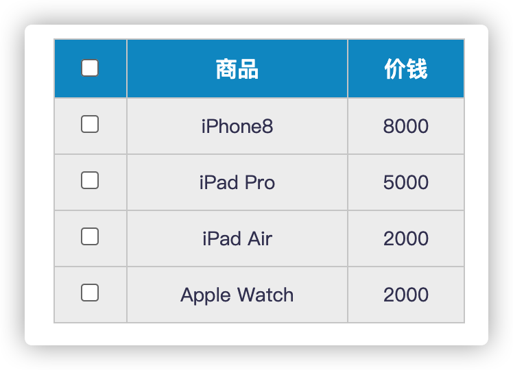
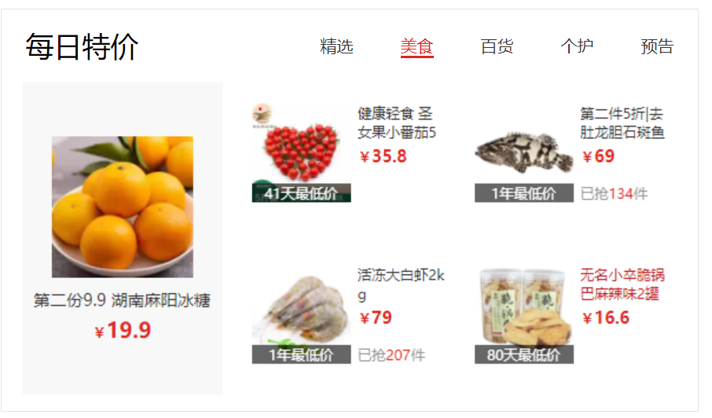
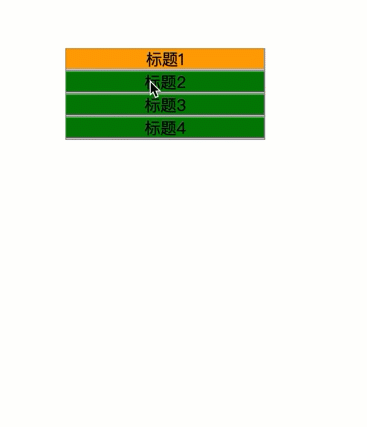
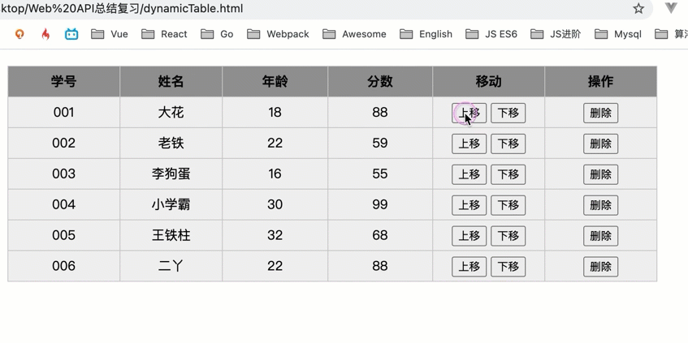

### 姓名	： 孙世鑫

### 分数	：

---

希望大家做选择和简答题部分时，不要把代码放在VSCode或浏览器上运行得出答案，全靠自觉哈~ 考试分数不重要，重点是掌握知识点，查漏补缺。

！！ 注意，同学们记得边做边保存文件！！ Ctrl + S 保存！！

代码题在文件夹中有对应的html文件哈！


## 一、单选题（共30题，总分60分）

##### 1. 关于DOM中获取元素的方法，下列说法正确的是？   （B ）

A: 	document.querySelector('.box') 是获取页面所有的元素

B: 	document.querySelector('.box') 是获取页面第一个类名为box的元素

C: 	document.querySelectorAll('.box') 是获取页面最后一个类名为box的元素

D: 	document.querySelector('.box') 是获取页面所有类名为box的元素


##### 2. 关于js中的事件，下列说法错误的是？ (  B )

A:	元素不能注册同名事件,比如给同一个按钮同时注册2个点击事件

B:	事件注册之后，比如点击，鼠标经过等事件，不会立即触发

C:	页面中DOM元素是都可以注册事件的

D:	事件既可以通过用户交互来触发，也可以使用代码主动触发,比如 btn.click()


##### 3. 关于innerText与innerHTML下列说法正确的是？ ( D )

A:	innerText与innerHTML作用完全一致，没有任何区别

B:	innerText属性里设置的标签可以被解析

C:	innerText获取内容的时候，如果内容中有HTML标签，标签会被正常解析

D:	innerHTML获取内容得到的是一个包含HTML标签的字符串


##### 4. 关于window对象，下列说法错误的是?    	（ A	）

A:	window对象是浏览器里的顶级对象

B:	window对象的属性和方法在调用时，可以省略window

C:	console.log(window.document === document) 这行代码会打印true

D:	window对象的load事件会在页面DOM树加载完毕后立马执行


##### 5.  下列选项关于事件委托说法错误的是？ (  B )

A: 事件委托可以解决事件绑定程序过多的问题

B: 事件委托利用了事件捕获原理

C: 事件委托可以提高代码性能

D: 事件委托可以应用在click, mousemove等事件中


##### 6. 下面代码输出什么  ( B )

```js
for (var i = 0; i < 3; i++) {
    setTimeout(function () {
        console.log(i);
    }, 1);
}
for (let i = 0; i < 3; i++) {
    setTimeout(function () {
        console.log(i);
    }, 1);
}
```

A:  0 1 2             0 1 2

B:  0 1 2             3 3 3

C:  3 3 3             0 1 2

C:  3 3 3             3 3 3


##### 7. 下面代码输出什么？( B )

```js
let c = { greeting: "Hey!" };
let d = c;
c.greeting = "Hello";
console.log(d.greeting);
```

- A: `Hello`
- B: `undefined`
- C: `ReferenceError`
- D: `TypeError`


##### 8. cool_secret可以访问多长时间? ( C )

```js
sessionStorage.setItem("cool_secret", 123);
```

- A：永远，数据不会丢失。
- B：用户关闭选项卡时。 (页面)
- C：当用户关闭整个浏览器时，不仅是选项卡。
- D：用户关闭计算机时。


##### 9.  下面输出正确的是 ( C )
```js
console.log('开始执行');
setTimeout(function(){
  console.log('timeout1')
},0);
console.log("结束了")
```

- A：开始执行，timeout1，结束了
- B：timeout1，开始执行，结束了
- C：开始执行，结束了，timeout1
- D:  以上都不对


##### 10. 下面打印name值是多少 ( B )
```js
var name = "jimmy";
var a = {
    name: "chimmy",
    fn : function () {
        console.log(this.name); 
    }
}
console.log(window.name) 
a.fn(); 
```

A:  jimmy    	chimmy

B:  jimmy 		jimmy

C: chimmy		jimmy

D: chimmy		chimmy		


##### 11. 下边这代码输出的结果是：（ A ）

```js
function showCase(value) {
    switch(value) {
    case 'A':
        console.log('Case A');
        break;
    case 'B':
        console.log('Case B');
        break;
    case undefined:
        console.log('undefined');
        break;
    default:
        console.log('Do not know!');
    }
}
showCase(new String('A'));

```
A、Case A

B、Case B

C、undefined

D、Do not know!


##### 12. 下面代码输出什么？（ B ）

```js
const numbers = [1, 2, 3];
numbers[10] = 11;
console.log(numbers);
```

A: [1, 2, 3, 7 x null, 11]

B: [1, 2, 3, 11]

C: [1, 2, 3, 7 x empty, 11]

D: SyntaxError


##### 13. 下边代码输出的结果是  （ D  ）

```js
var name = 'World!';
(function () {
    if (typeof name === 'undefined') {
        var name = 'Jack';
        console.log('Goodbye ' + name);
    } else {
        console.log('Hello ' + name);
    }
})(); 

```

A: Goodbye Jack

B: Hello Jack

C: Hello undefined

D: Hello World


##### 14. 以下js操作Array的方法中不能添加元素的是：（	B   ）

A、push

B、pop

C、unshift

D、splice


##### 15. var arr = [];   typeof arr 的结果是( C   )

A、array

B、function

C、object

D、undefined


##### 16. 以下代码执行后，console 的输出是 ( A )

```js
function Foo(){
	console.log(this.location);
}
Foo();
```

A、当前窗口的 Location 对象

B、undefined

C、null

D、TypeError


##### 17. 事件传播的三个阶段是什么 ？   ( B )

A:	目标 -->  捕获  -->  冒泡

B:	冒泡  --> 目标 -->   捕获

C:    目标  --> 冒泡  -->  捕获

D:    捕获  --> 目标  -->  冒泡


##### 18. 下列事件哪个不是由鼠标触发的事件？ ( D )

A、click

B、contextmenu

C、mouseout

D、keydown


##### 19. 下面数组的方法中，哪个方法不能改变自身数组 ( B )

A、splice

B、concat

C、sort

D、pop


##### 20. 要在10秒后调用checkState，下列哪个是正确的 ( D )

A、window.setTimeout(checkState, 10);

B、window.setTimeout(checkState(), 10);

C、window.setTimeout(checkState, 10000);

D、window.setTimeout(checkState(), 10000);


##### 21.以下不支持冒泡的鼠标事件为( D )

A. mouseover 

B. click 

C. mouseleave 

D. mousemove


##### 22. 在javascript中，用于阻止默认事件的默认行为的方法是 ( C )

A. **stopDeafault**() 

B. **stopPropagation**() 

C. **preventDefault**() 

D. **preventDefaultEven**()


##### 23. DOM中，给父节点添加子节点的正确方法为 ( D )

A. **appendChild**(parentNode,newNode); 

B. **append**(parentNode,newNode); 

C. parentNode.**append**(newNode); 

D. parentNode.**appendChild**(newNode);


##### 24. **下列定义的 css 中，哪个权重是最低的？** ( C )

A、#game .name

B、#game .name span

C、#game div

D、#game div.name


##### 25. Chrome浏览器中，获取鼠标单击页面位置的是（ B ）。

A. clientX和clientY

B. pageX和pageY

C. screenX和screenY

D. scrollLeft和scrollTop


##### 26. 正则表达式`/[am][efgr]/ig`匹配字符串“programmer”的结果是（ A ）。

A. am

B. er

C. ra

D. me


##### 27. 有正则表达式`/^\d{5,12}$/`,以下选项中能够匹配的是（ A ）

A、a100

B、8046976243181

C、80010

D、abcod


##### 28.在js中使用Date()对象中的哪个方法可以返回该日期对象对应的星期？（ D ）

A、getDate()

B、getFullYear()

C、getMonth()

D、getDay()


##### 29.页面有一个按钮button id为 button1，通过原生的js如何禁用 ( C )

A: document.getElementById("button1").readolny= true;

B: document.getElementById("button1").setAttribute(“readolny”,”true”);

C: document.getElementById("button1").disabled = true;

D: document.getElementById("button1").getAttribute(“disabled”,”true”);


##### 30. 以下关于let和const的说法中正确的是 (多选   ：A B C    )

A. **let**声明的变量值和类型都可以改变 

B. **const**声明的常量不可以改变

C. 两者都不存在变量提升，同时存在暂时性死区，只能在声明的位置后面使用 

D. **const**可以先声明再初始化，可以后赋值

---


## 二、 简答题  （共11题，总分50分）

##### 1. 说一说 标准盒模型  IE盒模型 区别 ？   (4 分)

##### 标准盒模型(W3C)


##### IE盒模型


##### 2. flex属性中的 0, 1, auto分别代表什么意思？（4分）

```css
flex: 0 1 auto;
```

```js
// 解答：
0:0份
1:将剩余空间分成一份
auto：居中
```


##### 3. 说一说事件委托的原理 ？（4分）

```js
// 事件委托是便于我们不需要给每个子元素单独取类名区分调用，给大盒子绑定事件，利用事件冒泡的方法点击父元素下的子元素从而触发父级元素的属性
```


##### 4. 下面的代码打印什么内容 （4分）

```js
var a = 10
;(function(){
  console.log(a)   
  var a = 5
  console.log(window.a)  
  console.log(this.a)    
  a = 20
  console.log(a)        
})()

10 10 10 window.5 20
```


##### 5. 下列程序的输出结果是什么？（4分）

```js
var x = 1

var obj = {
  x: 3,
  fun: function(){
    var x = 5
    return this.x
  }
}
var fun = obj.fun
console.log(obj.fun(), fun()) 

5 5
```


##### 6.  e.target 和 e.currentTarget 的区别 ？（4分）

e.target指向的是触发事件的对象

##### 7. sessionStorage 和 localStorage的区别？（4分）

sessionStorage 存活周期是关闭页面浏览器，存储的数据就会消失

localStorage永久存储，除非用户自行删除，或者卸载浏览器，清除缓存

##### 8. 获取页面被卷去的头部有哪两种方式？ （4分)

scrollTop

##### 9. 水平垂直居中的方式？（6分）

父级设置相对定位，子元素设置绝对定位，top 50%  left 50% 子元素减去自身大小的一半

给父级添加 display：flex   ju..... : center     a..g.. : center

给父级子级设置宽高，将子级变为行内块元素 给父级添加跟自身高度相等的行高，


##### 10. 讲一讲JS的执行机制呢？（6分）

判断同步和异步进程

执行同步进程的过程中，异步进程也在执行，但是需要在同步进程执行完毕后去查看是否有满足条件的异步进程，不断循环


##### 11  基本数据类型有哪些？检测数据类型(基本类型，引用类型)的方式？（6分）

```js
// 解答：
基本数据类型：number  string 字符串等  
检测数据类型的方式：typeof  .string() 等
```


---


## 三、 代码题 （共40分）

##### 1. 动态创建一个div， 满足以下条件。   （6分）

1. 用Javascript动态创建一个div元素，将id设置为“mydiv”。  
2. 并设置一个值为 “hello JS” 的自定义属性 data-self。        
3. 该div字体颜色为orange，字号18，内容为”Javascript DIV”。并将该元素追加到body中来显示。

```js
// 注意代码题可以先在vscode中运行，之后往这里粘贴js代码
<!DOCTYPE html>
<html lang="en">
<head>
    <meta charset="UTF-8">
    <meta http-equiv="X-UA-Compatible" content="IE=edge">
    <meta name="viewport" content="width=device-width, initial-scale=1.0">
    <title>Document</title>
</head>
<body>
    <div data-self="hello_JS">
        Javascript DIV
    </div>
    <script>
        const div = document.querySelector('div')
        div.style.color = 'orange'
        div.style.fontSize = '18px'
    </script>
</body>
</html>
```


##### 2. 实现表格的全选和反选功能   （6分）

需求：

1. 点击上面全选复选框，下面所有的复选框都选中（全选）
2. 再次点击全选复选框，下面所有的复选框都不中选（取消全选）
3. 如果下面复选框全部选中，上面全选按钮就自动选中
4. 如果下面复选框有一个没有选中，上面全选按钮就不选中




```js
// 此处粘贴代码
<!DOCTYPE html>
<html>

<head lang="en">
    <meta charset="UTF-8">
    <title></title>
    <style>
        * {
            padding: 0;
            margin: 0;
        }
        
        .wrap {
            width: 300px;
            margin: 100px auto 0;
        }
        
        table {
            border-collapse: collapse;
            border-spacing: 0;
            border: 1px solid #c0c0c0;
            width: 300px;
        }
        
        th,
        td {
            border: 1px solid #d0d0d0;
            color: #404060;
            padding: 10px;
        }
        
        th {
            background-color: #09c;
            font: bold 16px "微软雅黑";
            color: #fff;
        }
        
        td {
            font: 14px "微软雅黑";
        }
        
        tbody tr {
            background-color: #f0f0f0;
            text-align: center;
        }
        
        tbody tr:hover {
            cursor: pointer;
            background-color: #fafafa;
        }
    </style>

</head>

<body>
    <div class="wrap">
        <table>
            <thead>
                <tr>
                    <th>
                        <input type="checkbox" id="j_cbAll" />
                    </th>
                    <th>商品</th>
                    <th>价钱</th>
                </tr>
            </thead>
            <tbody id="j_tb">
                <tr>
                    <td>
                        <input type="checkbox" />
                    </td>
                    <td>iPhone8</td>
                    <td>8000</td>
                </tr>
                <tr>
                    <td>
                        <input type="checkbox" />
                    </td>
                    <td>iPad Pro</td>
                    <td>5000</td>
                </tr>
                <tr>
                    <td>
                        <input type="checkbox" />
                    </td>
                    <td>iPad Air</td>
                    <td>2000</td>
                </tr>
                <tr>
                    <td>
                        <input type="checkbox" />
                    </td>
                    <td>Apple Watch</td>
                    <td>2000</td>
                </tr>

            </tbody>
        </table>
    </div>
    <script>
        // 获取元素 顶部全选 和单选四个
        const btnAll = document.querySelector('#j_cbAll')
        const btn = document.querySelectorAll('#j_tb input')
        console.log(btnAll)
        console.log(btn)
        btnAll.addEventListener('click', function(e){
            if(e.target === btnAll){
                

            }
        })
    </script>
</body>

</html>
```


##### 3. 实现tab栏切换功能  6分




```js
// 此处粘贴代码
<!DOCTYPE html>
<html lang="en">

<head>
  <meta charset="UTF-8" />
  <meta http-equiv="X-UA-Compatible" content="IE=edge" />
  <meta name="viewport" content="width=device-width, initial-scale=1.0" />
  <title>tab栏切换</title>
  <style>
    * {
      margin: 0;
      padding: 0;
    }

    .tab {
      width: 590px;
      height: 340px;
      margin: 20px;
      border: 1px solid #e4e4e4;
    }

    .tab-nav {
      width: 100%;
      height: 60px;
      line-height: 60px;
      display: flex;
      justify-content: space-between;
    }

    .tab-nav h3 {
      font-size: 24px;
      font-weight: normal;
      margin-left: 20px;
    }

    .tab-nav ul {
      list-style: none;
      display: flex;
      justify-content: flex-end;
    }

    .tab-nav ul li {
      margin: 0 20px;
      font-size: 14px;
    }

    .tab-nav ul li a {
      text-decoration: none;
      border-bottom: 2px solid transparent;
      color: #333;
    }

    .tab-nav ul li a.active {
      border-color: #e1251b;
      color: #e1251b;
    }

    .tab-content {
      padding: 0 16px;
    }

    .tab-content .item {
      display: none;
    }

    .tab-content .item.active {
      display: block;
    }
  </style>
</head>

<body>
  <div class="tab">
    <div class="tab-nav">
      <h3>每日特价</h3>
      <ul>
        <li><a class="active" href="javascript:;">精选</a></li>
        <li><a href="javascript:;">美食</a></li>
        <li><a href="javascript:;">百货</a></li>
        <li><a href="javascript:;">个护</a></li>
        <li><a href="javascript:;">预告</a></li>
      </ul>
    </div>
    <div class="tab-content">
      <div class="item active"></div>
      <div class="item"></div>
      <div class="item"></div>
      <div class="item"></div>
      <div class="item"></div>
    </div>
  </div>
  <script>
    // 鼠标点击 或者 经过事件都可以哈~~
    const nav = document.querySelector('.tab-nav ul')
    const img = document.querySelectorAll('.tab-content img')
    console.log(nav)
    console.log(img)
    // 绑定点击事件
    nav.addEventListener('click', function (e) {
      // 如果点击的是a标签
      if (e.target.tagName === 'A') {
        // 删除active 
        nav.querySelector('.active').classList.remove('active')
        // 点击哪个给哪个添加active
        e.target.classList.add('active')
      }
      


    })
  </script>
</body>

</html>
```


##### 4. 请实现下面功能      6分



```js
// 此处粘贴代码
<!DOCTYPE html>
<html lang="en">

<head>
    <meta charset="UTF-8">
    <meta http-equiv="X-UA-Compatible" content="IE=edge">
    <meta name="viewport" content="width=device-width, initial-scale=1.0">
    <title>Document</title>
</head>
<style>
    * {
        padding: 0;
        margin: 0;
    }

    ul {
        list-style-type: none;
    }

    .parentWrap {
        width: 200px;
        text-align: center;
        margin: 50px auto auto;

    }

    .menuGroup {
        border: 1px solid #999;
        background-color: green;
    }

    .groupTitle {
        display: block;
        height: 20px;
        line-height: 20px;
        font-size: 16px;
        border-bottom: 1px solid #ccc;
        cursor: pointer;
    }

    .menuGroup>div {
        height: 200px;
        background-color: #fff;
        display: none;
    }

    .bg {
        background: orange;
    }
    .block {
        display: block;
    }
</style>

<body>
    <ul class="parentWrap">
        <li class="menuGroup bg">
            <span class="groupTitle">标题1</span>
            <div data-id="0">我是弹出来的div1</div>
        </li>
        <li class="menuGroup">
            <span class="groupTitle">标题2</span>
            <div data-id="1">我是弹出来的div2</div>
        </li>
        <li class="menuGroup">
            <span class="groupTitle">标题3</span>
            <div data-id="2">我是弹出来的div3</div>
        </li>

        <li class="menuGroup">
            <span class="groupTitle">标题4</span>
            <div data-id="3">我是弹出来的div4</div>
        </li>
    </ul>
    <script>
        const lis = document.querySelector('.parentWrap')
        console.log(lis)
        lis.addEventListener('click', function (e) {
            if(e.target.tagName === 'SPAN'){
                lis.querySelector('.bg').classList.remove('bg')
                e.target.classList.add('bg')
            }
            
        })
    </script>
</body>

</html>
```


##### 5. 根据提供的数据，动态创建表格，并实现表格上下移动和删除的功能  （16分）



需求：

1. 动态创建表格

2. 表格行可上下移动，顶部上移第一条提示 --   已经到顶啦（不可再往上移动）

3. 表格底部下移最后一条提示 -- 已经到底啦 

4. 支持删除功能

   

可参考：

- 事件委托  `e.target`,    `innerHTML`
- document.createElement
- node.appendChild
- node.insertBefore
- node.parentNode
- node.children
- node.lastElementChild
- node.nextElementSibling
- node.previousElementSibling
- node.removeChild

**提示， 上下移动每一个tr， 可以用insertBefore() 实现 ， 当我们第一个参数是本身已存在的元素时， 可以做移动。**


```js
// 此处粘贴代码
```


