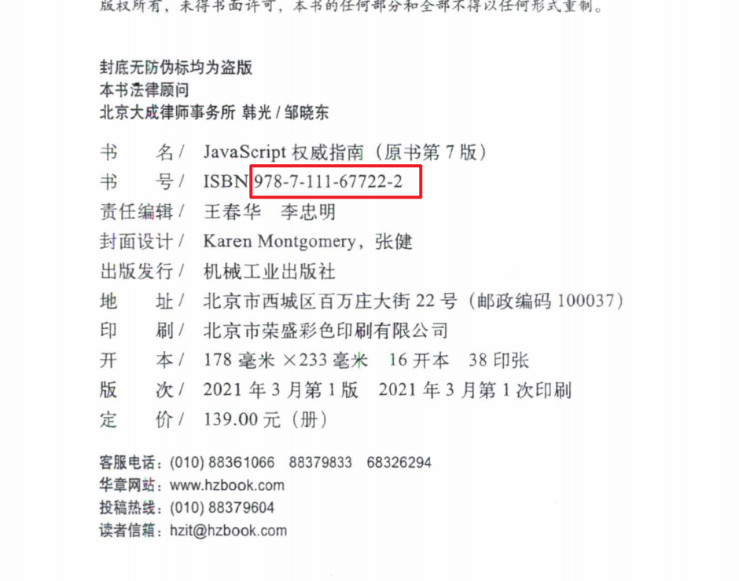
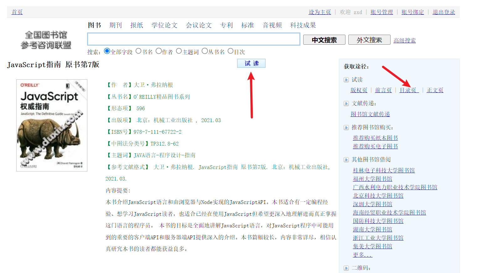
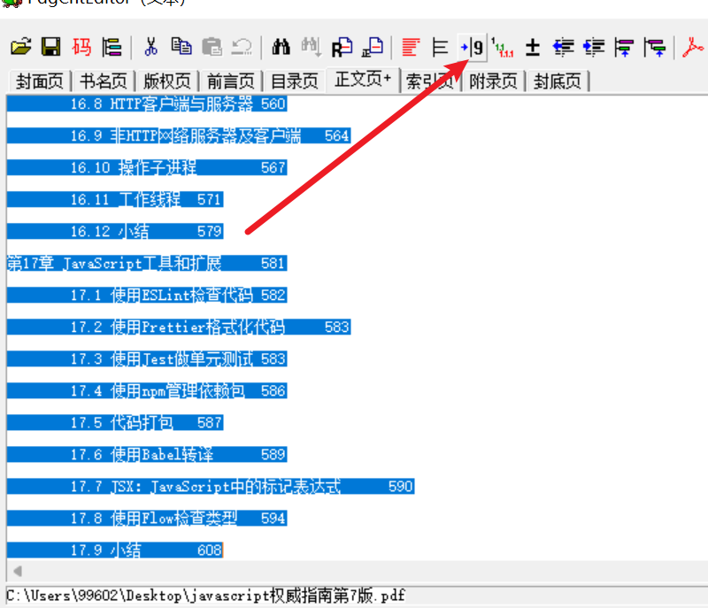

## 1. 查找书籍的ISBN码

## 2. 通过ISBN码搜索图书

[全国参考咨询联盟](http://www.ucdrs.superlib.net/)

- 注册一个，姓名可以不用填真实姓名。

### 3. 获取图书的SS码

> 点开书籍，点击 **试读** 或者 点击**目录页**等都可以

## 4. 获取URL地址中的base

> base后面的即是我们要获取的SS码

## 5.打开我们的书签获取软件

> 通过SS码，查询接口获取书签的目录，注意，这个接口不要恶意使用，以后可能用不了了

> 如果以后接口用不了了，也可以自己在京东上，搜索书名，里面详情页中有目录信息，也可以粘贴出来使用

### 商品介绍-目录

## 6. 使用PdgCntEditor

> 使用PdgCntEditor编辑PDF书签

### 1. 先打开软件，然后将pdf拖入到软件中

### 2. 将我们的书签目录信息粘贴到软件中

### 3. 选中所有，然后点击自动切分页码

### 4. 保存，即可使用，注意，保存的时候，PDF软件不能打开当前书籍

## 下载电子书的网站

1. [鸠摩搜书](https://www.jiumodiary.com/)
2. [https://www.mrsd.top](https://www.mrsd.top/)
3. [无名图书](https://www.book123.info/)
4. https://libgen.ink/
5. https://clibrary.cn/
6. [镜像资源](https://www.ooopn.com/)
7. [知乎-有没有书籍PDF下载网站？](https://www.zhihu.com/question/390350642)

## OCR识别软件

https://github.com/miaomiaosoft/PandaOCR